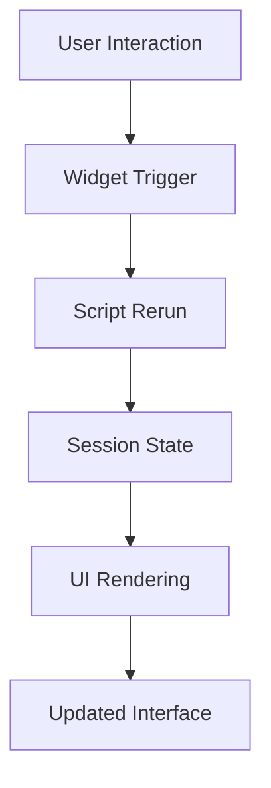

<div align="center">

# Interactive Web Apps with Streamlit


### Master Streamlit Through Practical, Concept-Driven Examples

Build a deep understanding of Streamlit's execution model, session state, caching, layouts, forms, callbacks, and multipage applications through hands-on implementations.

[](https://python.org)
[](https://streamlit.io)

</div>

---

# Project Overview

Most Streamlit tutorials focus on syntax.

This repository focuses on understanding **how Streamlit actually works**.

It provides a structured learning path covering:

* Streamlit execution model
* Widget behavior
* Forms and validation
* Session State
* Callbacks
* Rerun mechanics
* Data caching
* Resource caching
* Layout systems
* Fragments
* Multipage applications
* Advanced widget interactions

Each file demonstrates a single concept in isolation, making it easier to understand the underlying behavior of Streamlit applications.

---

# Learning Objectives

After completing this repository, you will be able to:

* Understand Streamlit's rerun architecture
* Manage persistent application state
* Design interactive forms
* Implement callback-driven interfaces
* Optimize applications using caching
* Create responsive layouts
* Build scalable multipage applications
* Debug unexpected reruns
* Design production-ready Streamlit applications

---

# Table of Contents

* Project Overview
* Learning Roadmap
* Technology Stack
* Architecture
* Concepts Covered
* Project Structure
* Installation
* Usage
* Practical Applications
* Future Enhancements
* Author

---

# Streamlit Execution Architecture



---

# Learning Roadmap

```text
1. Streamlit Execution Model
        ↓
2. Text & UI Elements
        ↓
3. Data Rendering
        ↓
4. Charts & Visualization
        ↓
5. Forms
        ↓
6. Session State
        ↓
7. Callbacks
        ↓
8. Reruns
        ↓
9. Caching
        ↓
10. Layouts
        ↓
11. Fragments
        ↓
12. Multipage Applications
        ↓
13. Advanced Widget Patterns
```

---

# Technology Stack

| Category            | Technology                 |
| ------------------- | -------------------------- |
| Language            | Python                     |
| Framework           | Streamlit                  |
| Data Processing     | Pandas                     |
| Numerical Computing | NumPy                      |
| Visualization       | Matplotlib                 |
| State Management    | Streamlit Session State    |
| Caching             | cache_data, cache_resource |
| UI Components       | Forms, Widgets, Layouts    |
| App Architecture    | Multipage Streamlit        |

---

# Concepts Covered

## 1. Execution Model

Files:

* `streamlit_dataflow.py`

Topics:

* Top-to-bottom execution
* Script reruns
* Widget-triggered execution
* Stateless behavior

Key Learning:

Understand why variables reset and how Streamlit reruns applications after every interaction.

---

## 2. Text Elements

Files:

* `text_elements.py`

Topics:

* Titles
* Headers
* Subheaders
* Markdown
* Captions
* Code blocks
* Images
* Dividers

---

## 3. Data Elements

Files:

* `data_elements.py`

Topics:

* DataFrames
* Tables
* Data Editor
* Metrics
* JSON rendering

Applications:

* Dashboards
* Analytics apps
* Data exploration tools

---

## 4. Charts & Visualization

Files:

* `chart_elements.py`

Supported Visualizations:

| Chart Type   | Purpose              |
| ------------ | -------------------- |
| Line Chart   | Trends               |
| Area Chart   | Cumulative patterns  |
| Bar Chart    | Comparisons          |
| Scatter Plot | Relationships        |
| Maps         | Geospatial data      |
| Matplotlib   | Custom visualization |

---

## 5. Forms

Files:

* `simple_form.py`
* `advance_form.py`
* `form_elements.py`

Topics:

* Form submission
* Validation
* Input handling
* User feedback
* Multi-field forms

---

## 6. Session State

Files:

* `session_state1.py`
* `session_state2.py`
* `session_state3.py`

Topics:

* State persistence
* Counters
* Reset logic
* Dynamic UI behavior

Why It Matters:

Session State is one of the most important concepts in Streamlit because every interaction reruns the script.

---

## 7. Callbacks

Files:

* `callbacks.py`

Topics:

* on_change callbacks
* State updates
* Reactive interfaces

Benefits:

* Better user experience
* Controlled state transitions
* Cleaner application logic

---

## 8. Rerun Mechanics

Files:

* `rerun.py`

Topics:

* Immediate updates
* Forced reruns
* UI synchronization

---

## 9. Caching

Files:

* `caching1.py`
* `caching2.py`

### cache_data

Used for:

* API calls
* Data processing
* Expensive computations

### cache_resource

Used for:

* Database connections
* ML models
* File handlers
* External resources

---

## 10. Layouts

Files:

* `layouts.py`

Components:

* Sidebar
* Columns
* Tabs
* Containers
* Expanders
* Empty placeholders

---

## 11. Fragments

Files:

* `fragments.py`

Topics:

* Partial rerendering
* UI modularization
* Performance optimization

---

## 12. Multipage Applications

Files:

* `multi_pages_app.py`

Features:

* Sidebar navigation
* Dynamic pages
* Modular architecture

Applications:

* Enterprise dashboards
* Analytics platforms
* Business applications

---

## 13. Advanced Widget Concepts

Files:

* `advance_widget_concepts1.py`
* `advance_widget_concepts2.py`

Topics:

* Dynamic defaults
* Dependent widgets
* Conditional rendering
* Preserving user input

---

# Project Structure

```text
Interactive-Web-Apps-with-Streamlit/
│
├── streamlit_dataflow.py
├── text_elements.py
│
├── data_elements.py
├── chart_elements.py
│
├── simple_form.py
├── advance_form.py
├── form_elements.py
│
├── session_state1.py
├── session_state2.py
├── session_state3.py
│
├── callbacks.py
├── rerun.py
│
├── caching1.py
├── caching2.py
│
├── layouts.py
├── fragments.py
│
├── multi_pages_app.py
│
├── advance_widget_concepts1.py
├── advance_widget_concepts2.py
│
├── requirements.txt
└── README.md
```

---

# Installation

## Clone Repository

```bash
git clone https://github.com/Mohit-1307/Interactive-Web-Apps-with-Streamlit.git

cd Interactive-Web-Apps-with-Streamlit
```

---

## Create Virtual Environment

### Windows

```bash
python -m venv venv

venv\Scripts\activate
```

### Linux / macOS

```bash
python3 -m venv venv

source venv/bin/activate
```

---

## Install Dependencies

```bash
pip install -r requirements.txt
```

---

# Usage

Run any example:

```bash
streamlit run session_state1.py
```

Examples:

```bash
streamlit run streamlit_dataflow.py

streamlit run simple_form.py

streamlit run callbacks.py

streamlit run layouts.py

streamlit run multi_pages_app.py
```

---

# Reproducibility

To reproduce all examples:

1. Clone the repository
2. Install dependencies
3. Activate virtual environment
4. Execute files in roadmap order
5. Experiment with widget interactions
6. Observe rerun behavior
7. Explore session state updates

---

# Practical Applications

The concepts demonstrated in this repository are commonly used in:

### Data Science Dashboards

* KPI monitoring
* Reporting systems
* Analytics platforms

### Machine Learning Applications

* Model monitoring
* Prediction interfaces
* Experiment tracking

### Internal Business Tools

* Data entry systems
* Workflow management
* Reporting portals

### Research Tools

* Interactive visualizations
* Experiment dashboards
* Data exploration

---

# Key Learnings

This repository teaches:

* Streamlit execution flow
* Persistent state management
* Widget lifecycle
* Controlled reruns
* Caching strategies
* Layout design
* Modular application architecture
* Interactive dashboard development

---

# Future Improvements

Potential additions:

* Authentication systems
* Database integration
* REST API integration
* Real-time dashboards
* WebSocket support
* LLM-powered Streamlit apps
* Deployment workflows
* Docker integration
* Cloud deployment guides

---

# Author

**MOHIT SINGH RAJPUT** — AI / ML Engineer

[](https://linkedin.com/in/mohitsingh1307)
[](https://github.com/Mohit-1307)
[](https://www.kaggle.com/mohitsinghrajput1307)
[](https://leetcode.com/u/MOHIT_SINGH_RAJPUT/)
[](mailto:mohitsinghrajput1307@gmail.com)

---

# Acknowledgements

Special thanks to:

* Streamlit Team
* Python Community
* Pandas Contributors
* NumPy Contributors
* Matplotlib Contributors

for creating the tools that make rapid application development possible.

---

<div align="center">

*If this project was useful, a ⭐ on the repository is appreciated.*

</div>
